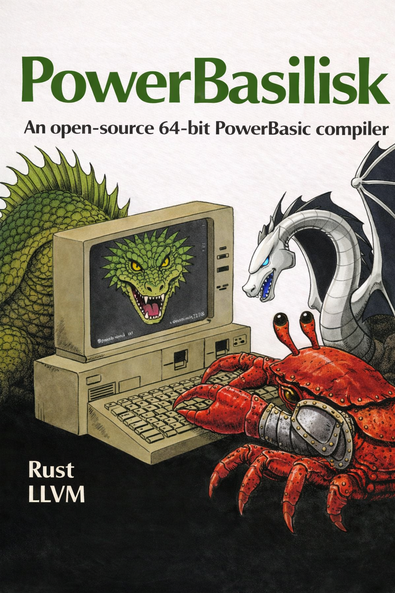

<p align="center">
  
</p>

<h1 align="center">PowerBasilisk</h1>

<p align="center">
  <b>An open-source 64-bit PowerBASIC compiler written in Rust, targeting LLVM IR</b>
</p>

<p align="center">
  <a href="https://github.com/benstopics/powerbasilisk/actions/workflows/ci.yml"></a>
  <a href="https://github.com/benstopics/powerbasilisk/blob/main/LICENSE"></a>
  <a href="https://www.rust-lang.org/"></a>
  <a href="https://llvm.org/"></a>
  <a href="https://github.com/benstopics/powerbasilisk"></a>
</p>

---

PowerBasilisk compiles [PowerBASIC](https://en.wikipedia.org/wiki/PowerBASIC) 9.x source code to **LLVM IR**, then uses `clang` to produce native executables, DLLs, or object files. It is written entirely in Rust with **zero external crate dependencies** for the core frontend.

The compiler generates LLVM IR as **plain text** (no `inkwell` or `llvm-sys` bindings required), making it easy to build and inspect the output at every stage.

## Features

| Feature | Status |
|---------|--------|
| Full PowerBASIC 9.x syntax (SUB, FUNCTION, IF, FOR, DO, SELECT CASE) | Done |
| Variables & arithmetic (LONG, INTEGER, DOUBLE, SINGLE, QUAD, BYTE, WORD) | Done |
| Arrays (1D, 2D, constant bounds, GLOBAL, LOCAL) | Done |
| Strings (dynamic STRING, STRING*N fixed, 16+ builtins) | Done |
| User-defined TYPEs (structs, nested field access, arrays of TYPE) | Done |
| DLL export/import (DECLARE LIB, ALIAS, EXPORT, --dll mode) | Done |
| GOSUB/RETURN, GOTO, labels (numeric and named) | Done |
| Session struct mode (`--session-struct` wraps all globals) | Done |
| VARPTR, pointer operations | Done |
| File I/O (OPEN, CLOSE, PRINT#, LINE INPUT#, INPUT#, EOF) | Done |
| Preprocessor (#INCLUDE, #IF, %CONSTANTS) | Done |
| Runtime library (FORMAT$, PARSE$, REMOVE$, REPLACE, USING$, DATE$, TIME$) | Done |
| Debug mode (`--debug` for function tracing and crash reporting) | Done |
| 32-bit PE output (x86 stdcall for Win32 API interop) | Done |

## Quick Start

### Prerequisites

- **Rust** 1.75+ (for building the compiler)
- **LLVM/Clang** 17+ (for compiling generated IR to native code)
  - Install via `winget install LLVM.LLVM` on Windows

### Build

```bash
git clone https://github.com/benstopics/powerbasilisk.git
cd powerbasilisk
cargo build --release
```

### Compile a PowerBASIC program

```bash
# Compile to object file
./target/release/pbcompiler build hello.bas -o hello

# Compile to executable
./target/release/pbcompiler build hello.bas -o hello --exe \
  --runtime-lib pbcompiler/runtime/pb_runtime.obj

# Compile to DLL
./target/release/pbcompiler build mylib.bas -o mylib --dll

# Emit LLVM IR only (for inspection)
./target/release/pbcompiler build hello.bas -o hello --emit-llvm
```

### Run the test suite

```bash
# Run all compiler level tests (L0-L12)
cargo build --release
for f in pbcompiler/tests/l*.bas; do
  echo "=== $f ==="
  ./target/release/pbcompiler build "$f" -o "${f%.bas}" --exe \
    --runtime-lib pbcompiler/runtime/pb_runtime.obj
  ./"${f%.bas}.exe"
  echo "Exit: $?"
done
```

## Architecture

```
                    PowerBasilisk Compiler Pipeline
 ┌──────────┐    ┌───────┐    ┌───────┐    ┌──────────┐    ┌──────────┐
 │ PB Source │───>│ Prepr │───>│  Lex  │───>│  Parse   │───>│ Codegen  │
 │  (.bas)   │    │ ocess │    │       │    │  (AST)   │    │(LLVM IR) │
 └──────────┘    └───────┘    └───────┘    └──────────┘    └────┬─────┘
                                                                │
                                                                v
                                                         ┌──────────┐
                                                         │ .ll file │
                                                         └────┬─────┘
                                                              │ clang
                                                              v
                                                    ┌─────────────────┐
                                                    │ .obj / .exe / . │
                                                    │       dll       │
                                                    └─────────────────┘
```

### Crate Structure

| Crate | Purpose |
|-------|---------|
| **`pb`** | Shared frontend: lexer, parser, AST, preprocessor. Zero dependencies. |
| **`pbcompiler`** | LLVM IR code generation, linking, CLI driver. Depends on `pb`. |

### Compilation Pipeline

| Phase | Input | Output | Time* |
|-------|-------|--------|-------|
| Preprocess | .bas + #INCLUDEs | Flattened source lines | ~0.0s |
| Lex | Source text | Token stream | ~0.1s |
| Parse | Tokens | AST (top-level items) | ~0.1s |
| Codegen | AST | LLVM IR (.ll) | ~0.3s |
| Compile | .ll | Object file (.obj) | ~30s |
| Link | .obj + libs | Executable/DLL | ~1s |

*\*Measured on an 89K-line PowerBASIC codebase producing 876K lines of LLVM IR.*

## CLI Reference

```
pbcompiler build <file.bas> [options]

Options:
  -o <path>              Output path (default: input with .obj extension)
  --exe                  Link to standalone executable
  --dll                  Link to shared library (DLL)
  --session-struct       Wrap all globals into a single exported struct
  --emit-llvm            Emit .ll file only (skip clang compilation)
  --parse-only           Parse and exit (no codegen)
  --debug                Enable debug mode (function tracing, crash handler)
  --runtime-lib <path>   Path to pb_runtime.obj for linking
  --lib-dir <path>       Directory containing import libraries (.lib)
  --split-threshold <N>  Split functions exceeding N IR lines (default: off)
```

## Type Mapping

| PowerBASIC | LLVM IR |
|------------|---------|
| `LONG`, `DWORD` | `i32` |
| `INTEGER`, `WORD` | `i16` |
| `BYTE` | `i8` |
| `QUAD` | `i64` |
| `DOUBLE`, `EXT`, `CUR` | `double` |
| `SINGLE` | `float` |
| `STRING` | `ptr` (null-terminated) |
| `STRING * N` | `[N x i8]` |
| `DIM arr(N)` | `[N+1 x T]` |
| `TYPE MyType` | `%MYTYPE = type { ... }` |

## Debug Mode

Compile with `--debug` to enable runtime diagnostics:

```bash
pbcompiler build program.bas -o program --exe --debug \
  --runtime-lib pbcompiler/runtime/pb_runtime.obj

# Enable verbose function-level logging
PB_DEBUG_VERBOSE=1 ./program.exe
```

| Log File | Contents |
|----------|----------|
| `pb_debug.log` | Function entry trace, crash info, modal text |
| `pb_crash.log` | Last crash details (function, line, exception code) |

## Session Struct Mode

The `--session-struct` flag wraps all global variables into a single LLVM struct, exported via `GetSession()`. This enables FFI consumers (C, C++, etc.) to access all program state through a single typed pointer:

```llvm
%PBSESSIONDATA = type { i32, double, [10 x i32], ... }
@pb.session = dllexport global %PBSESSIONDATA zeroinitializer

define dllexport ptr @GetSession() {
  ret ptr @pb.session
}
```

## Contributing

Contributions are welcome! Please open an issue or pull request.

### Development

```bash
# Build in debug mode (faster compilation)
cargo build

# Run clippy
cargo clippy --all-targets

# Format code
cargo fmt --all
```

## License

[MIT](LICENSE)
